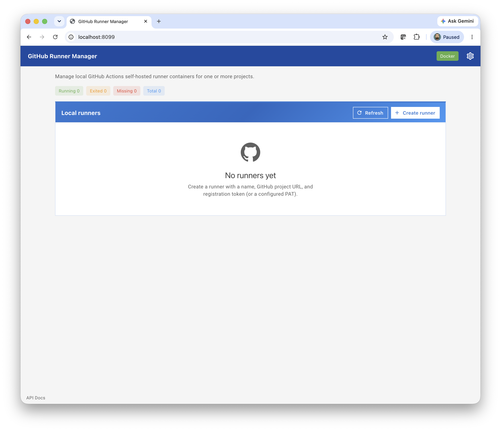
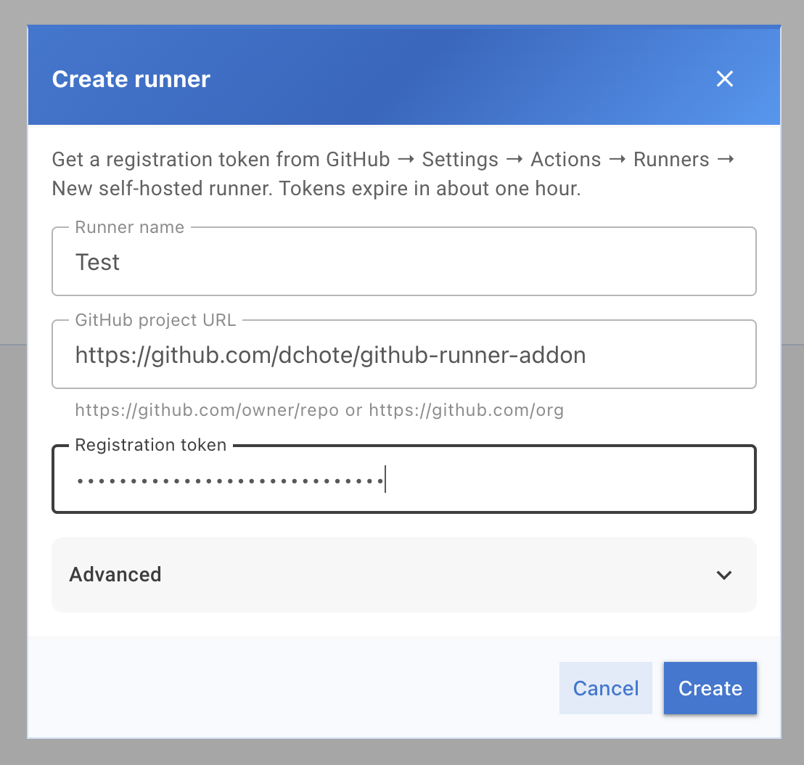
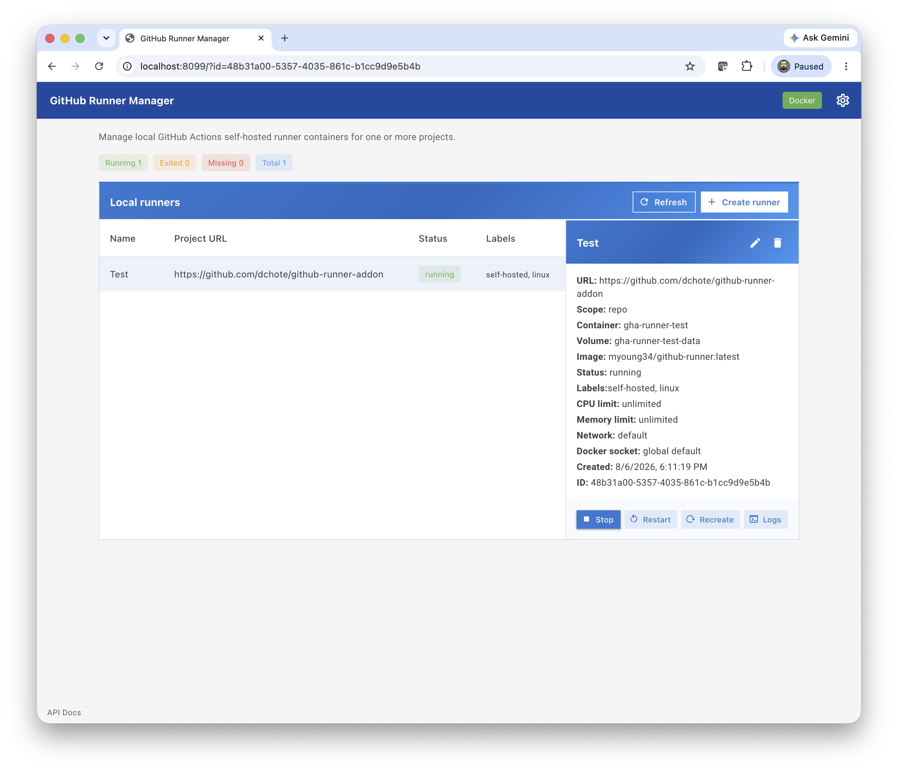
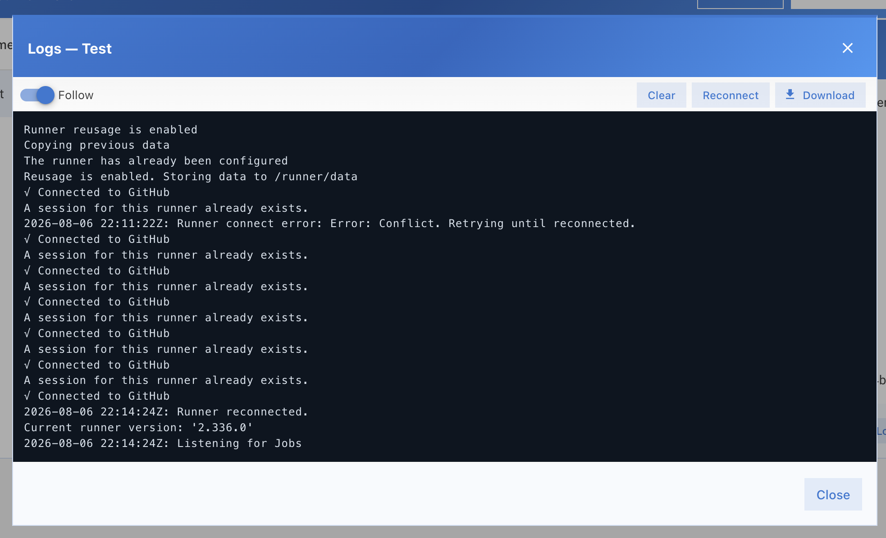

# GitHub Runner Manager

**A local control plane for GitHub Actions self-hosted runners** — manage a small fleet of persistent runners as Docker containers from a simple web UI. Built as a [Home Assistant](https://www.home-assistant.io/) app, and usable as a standalone Go binary or Compose stack on any Docker host.

This project is for home-lab and small-team operators who want CI on their own hardware **without** Kubernetes, Actions Runner Controller (ARC), or hand-running `config.sh` on the appliance. You point it at one or more GitHub repos (or orgs), create runners in the UI, and the manager keeps their expected config in a JSON file while Docker runs the actual runner processes.

## Why this exists

GitHub’s hosted runners are convenient, but self-hosted runners are often better for:

- Private networks, hardware, or GPUs you already own
- Jobs that need Docker / privileged tooling on a machine you control
- Avoiding per-minute hosted-runner costs for frequent home-lab CI

Doing that by hand means downloading the official runner tarball, registering with a short-lived token, and keeping each machine configured. **GitHub Runner Manager** turns that into: open the UI → create a runner → start / stop / logs / recreate from one place.

It is intentionally **not** an autoscaling platform. It manages a handful of **persistent** runners well.

## What you get

| Capability | Details |
|------------|---------|
| Multi-project fleet | Many runners, each bound to a repo or org URL |
| Operator UI | Vue + Vuetify (Material Design 3) embedded in the binary |
| Lifecycle | Create, start, stop, restart, edit, recreate, delete |
| Logs | Live follow over WebSocket; download snapshots |
| Optional GitHub PAT | Mint registration tokens and deregister on delete |
| Persistence | Expected config in `runners.json` (HA `/data`, backed up) |
| Packaging | Home Assistant app (GHCR or local build) or standalone Docker |

## Screenshots

Empty state before any runners exist:



Create a runner (name, project URL, registration token or PAT):



Fleet overview with status chips, runner table, and detail pane:



Live container logs with Follow over WebSocket:



## How it works

```text
┌─────────────────────────────┐
│  GitHub Runner Manager      │  ← this project (API + UI)
│  Go binary / HA app         │
└──────────────┬──────────────┘
               │ Docker Engine API
               ▼
┌─────────────────────────────┐
│  Runner containers          │  ← myoung34/github-runner (see Credits)
│  one container per runner   │
└──────────────┬──────────────┘
               │ registered to
               ▼
         GitHub Actions
```

1. You create a runner (name, GitHub URL, registration token **or** a configured PAT).
2. The manager starts a sibling container from the configured runner image (default: [`myoung34/github-runner`](https://github.com/myoung34/docker-github-actions-runner)).
3. Expected config is stored in `/data/runners.json` (tokens are not persisted there).
4. You monitor Docker status, stream logs, edit runtime settings, and recreate if a container goes missing.

**Consuming repos:** the short-lived container env `RUNNER_TOKEN` (registration) is not an Actions secret. Workflows that list runners and fall open to GitHub-hosted should use a separate Actions secret **`RUNNER_TOKEN`** (Administration: Read) — see [HA app DOCS — Consuming repositories](github_runner/DOCS.md#consuming-repositories-actions-secrets).

## Credits and attribution

### Runner containers: `myoung34/github-runner`

This manager does **not** implement the GitHub Actions runner agent itself. Each managed runner is a Docker container based on the excellent community image maintained by **Matt Young** (`myoung34`):

| | |
|--|--|
| **Image** | [`myoung34/github-runner`](https://hub.docker.com/r/myoung34/github-runner) |
| **Source** | [`github.com/myoung34/docker-github-actions-runner`](https://github.com/myoung34/docker-github-actions-runner) |
| **Default tag** | `myoung34/github-runner:latest` (override with `runner_image` / `RUNNER_IMAGE`; prefer a digest in production) |

That project wraps the official GitHub Actions runner with a Docker-friendly entrypoint (`REPO_URL` / `ORG_NAME`, `RUNNER_TOKEN`, labels, registration file reuse, and related env). **GitHub Runner Manager** is a control plane around it: we create/start/stop those containers, pass registration env, persist expected fleet config, and expose an operator UI.

If you use this addon, please also consider starring and supporting [myoung34/docker-github-actions-runner](https://github.com/myoung34/docker-github-actions-runner). Issues specific to runner image behavior (entrypoint, toolchains inside the container, registration quirks) belong upstream there; issues about the manager UI/API/HA packaging belong in this repository.

### Other

- Official [GitHub Actions self-hosted runners](https://docs.github.com/en/actions/hosting-your-own-runners) documentation and runner software are © GitHub.
- Home Assistant app packaging follows the [Home Assistant developer documentation](https://developers.home-assistant.io/).

## Docs

| Doc | Contents |
|-----|----------|
| [Product overview](docs/product-overview.md) | Goals, users, flows, non-goals |
| [Technical overview](docs/technical-overview.md) | Stack, runner model, env, PAT scopes |
| [Build and test](docs/build-and-test.md) | Dev build, tests, CI images |
| [Container runtime](docs/patterns/container-runtime.md) | Docker labels, volumes, cache/workdir, sock mount |
| [Persistent cache](docs/features/0003-persistent-runner-cache.md) | Volume / bind lifecycle |
| [Same-path build cache](docs/features/0006-same-path-build-cache.md) | Per-project host binds + `RUNNER_CACHE` for sibling Docker / Buildx |
| [Sibling Docker workdir](docs/features/0004-sibling-docker-workdir-host-bind.md) | Host same-path bind + agent `workFolder` reconfigure for `docker run -v $GITHUB_WORKSPACE` |
| [API design](docs/patterns/api-design.md) | REST envelope, endpoints, WebSocket |
| [0001 Fleet manager](docs/features/0001-runner-fleet-manager.md) | Create / lifecycle / logs contract |
| [0002 Hardened fleet](docs/features/0002-hardened-persistent-fleet.md) | PAT, recreate, edit, security close-out |
| [HA app DOCS](github_runner/DOCS.md) | In-Supervisor options, usage, and consuming-repo Actions secrets (`RUNNER_TOKEN`) |

## Layout

```text
repository.yaml          # HA app store repository metadata
github_runner/           # Home Assistant app (build context + application source)
  config.yaml            # App config; `image:` pulls from GHCR
  Dockerfile             # Multi-stage Node + Go + HA base
  DOCS.md                # Supervisor-facing documentation
  rootfs/                # s6 service → options.json → env
  cmd/ internal/ api/ frontend/
docs/                    # Product / technical / feature docs
.github/workflows/       # Official HA BuildKit publish to GHCR
```

## Prerequisites

- **Docker** Engine (for spawning runner containers; socket access required)
- For development: **Go 1.25+**, **Node 24+**
- For Home Assistant: Supervisor with ability to disable Protection mode for this app (`docker_api`)

## Quick start (standalone Docker)

```bash
docker compose up --build
```

Open http://127.0.0.1:8099

Compose binds **localhost only**. Access control is **network trust** — do not publish port 8099 on a public interface.

Optional environment:

| Variable | Purpose |
|----------|---------|
| `GITHUB_PAT` | Mint registration tokens + deregister on delete |
| `RUNNER_IMAGE` | Runner image (default `myoung34/github-runner:latest`) |
| `MOUNT_DOCKER_SOCK` | Mount host Docker socket into *runner* containers |
| `LOG_LEVEL` | `debug` / `info` / `warn` / `error` |

Prefer pinning `RUNNER_IMAGE` to an image digest in production.

## Home Assistant install

1. **Settings → Add-ons → Add-on store → Repositories**
2. Add `https://github.com/dchote/github-runner-addon`
3. Install **GitHub Runner Manager**
4. **Turn off Protection mode** for the app (required so `docker_api` can access the host Docker socket)
5. Optionally set **GitHub PAT** in app options (`repo` and/or org runner admin scopes — see [technical overview](docs/technical-overview.md#pat-scopes))
6. Optionally pin **Runner image** (default remains `myoung34/github-runner:latest`)
7. Start the app and open the UI via ingress

Persistent state: `/data/runners.json` (standard HA app data directory; included in backups).

### GHCR pull (default)

`github_runner/config.yaml` sets:

```yaml
image: ghcr.io/dchote/github-runner-addon
```

Supervisor pulls the multi-arch image published by CI (tag matches `version:`).

### Build locally on the HA host

1. Comment out the `image:` line in `github_runner/config.yaml`
2. Install or click **Rebuild**

**Security note:** `mount_docker_sock` defaults to **true** in the HA app so workflows can use Docker. That is root-equivalent on the host — disable it if your jobs do not need the socket.

## Building from source (developers)

```bash
make build
# → build/github-runner-addon
```

API-only iterate:

```bash
SKIP_FRONTEND=true ./scripts/build.sh
```

Split-process UI development:

```bash
# Terminal 1
cd github_runner && go run ./cmd/github-runner-addon -frontend-embed=false

# Terminal 2
cd github_runner/frontend && npm ci && npm run dev
```

```bash
make check   # go vet + go test
make lint    # frontend eslint
```

See [Build and test](docs/build-and-test.md) for CI and image details.

## API surface

| Endpoint | Purpose |
|----------|---------|
| `GET /api/v1/health` | Docker, store, counts, orphans, PAT configured |
| `GET/POST /api/v1/runners` | List / create |
| `GET/PATCH/DELETE /api/v1/runners/{id}` | Get / update / delete |
| `POST …/start\|stop\|restart\|recreate` | Lifecycle |
| `GET …/logs` | Plain-text log stream |
| `GET /ws` | WebSocket live logs (`container_logs`) |
| `GET /docs` | OpenAPI / Swagger UI (vendored; offline-capable) |

Under Home Assistant ingress, the UI resolves API and WebSocket URLs from the ingress base path (`X-Ingress-Path` / `<base href>`).

## License and third-party software

This repository’s application code is provided under the terms in [LICENSE](LICENSE).

Third-party components you will run alongside this manager include:

- **[myoung34/docker-github-actions-runner](https://github.com/myoung34/docker-github-actions-runner)** — default runner container image (see [Credits](#credits-and-attribution))
- **GitHub Actions runner** software inside that image (GitHub)
- **Docker Engine**, **Home Assistant** Supervisor / base images as used by your install

Always review upstream licenses and security advisories for the runner image tag or digest you pin.
